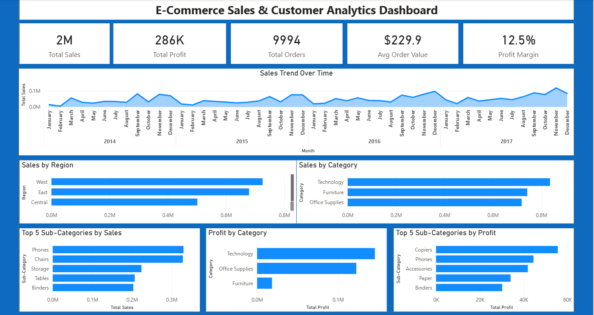
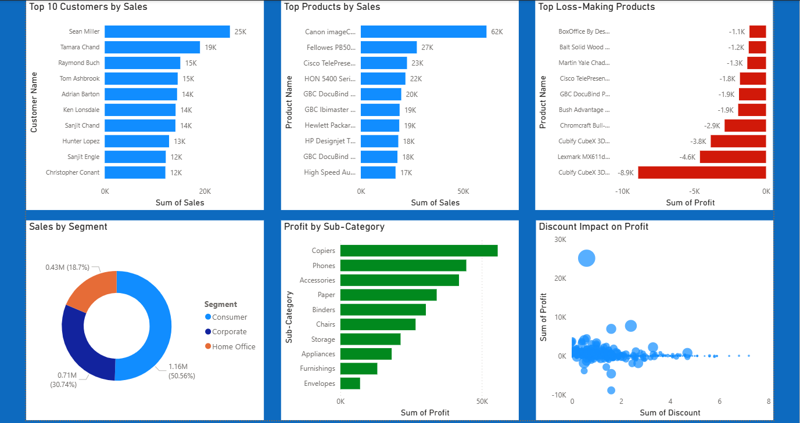

# 📊 E-Commerce Sales & Customer Analytics

## 🚀 Project Overview

This project presents an end-to-end data analytics solution to analyze e-commerce sales performance, customer behavior, and profitability.
The analysis was conducted using SQL, Python, and Power BI to transform raw transactional data into meaningful business insights.

The project identifies key revenue drivers, loss-making products, and the impact of discount strategies on profitability.

---

## 🎯 Objectives

- Analyze overall sales, profit, and order volume
- Identify top-performing customers and products
- Detect loss-making products
- Evaluate the impact of discounts on profitability
- Perform regional and category-level analysis

---

## 📊 Key Metrics (KPIs)

- Total Sales: **2.29M**
- Total Profit: **286K**
- Total Orders: **9,994**
- Average Order Value: **$229.9**
- Profit Margin: **12.5%**

---

## 🛠️ Tools & Technologies

- **SQL (MySQL)** – Data extraction and querying
- **Python (Pandas, Matplotlib)** – Data cleaning and analysis
- **Power BI** – Interactive dashboard and visualization
- **Excel / CSV** – Data source

---

## 📊 Dashboard Preview

### 🔹 Executive Overview



👉 Provides a high-level summary of sales, profit, orders, and overall performance trends.

---

### 🔹 Detailed Analysis



👉 Focuses on deeper insights such as top customers, top products, loss-making products, and discount impact on profitability.

---

## 📈 Dashboard Features

- KPI overview cards (Sales, Profit, Orders, Profit Margin)
- Sales trend analysis over time
- Regional and category-wise performance
- Top customers and top products analysis
- Identification of loss-making products
- Discount impact on profitability

---

## 🧹 Data Preparation

- Handled missing values and cleaned data
- Converted date columns and standardized formats
- Fixed incorrect data types
- Created calculated measures (KPIs)
- Validated results using Python and SQL

---

## 📊 Key Insights

- The Technology category generates the highest sales and profit
- A small group of customers contributes a significant portion of total revenue
- Higher discount levels negatively impact profitability
- Several products consistently generate losses
- Sales show a steady upward trend over time

---

## 📁 Project Structure

```
Ecommerce-Sales-Customer-Analytics/
│
├── DASHBOARD/
│   └── ecommerce_dashboard.pbix
│
├── DATA/
│   └── dataset.csv
│
├── IMAGES/
│   ├── executive_overview.png
│   └── detailed_analysis.png
│
├── PYTHON/
│   └── ecommerce_analysis.ipynb
│
├── SQL/
│   └── queries.sql
│
├── REPORTS/
│   └── Ecommerce_Sales_Customer_Analytics_Report.pdf
│
└── README.md
```

---

## 💼 Business Value

This project enables businesses to:

- Identify high-value customers and top-performing products
- Reduce losses by addressing underperforming products
- Optimize discount strategies
- Improve decision-making using data-driven insights

---

## 🧾 Conclusion

This project demonstrates how combining SQL, Python, and Power BI can deliver a complete analytical solution.
It provides actionable insights that help improve profitability and support strategic business decisions.

---

## 👤 Author

**Krishna Bhise**
Aspiring Data Analyst

---

## ⭐ Support

If you found this project useful, consider giving it a ⭐ on GitHub!
